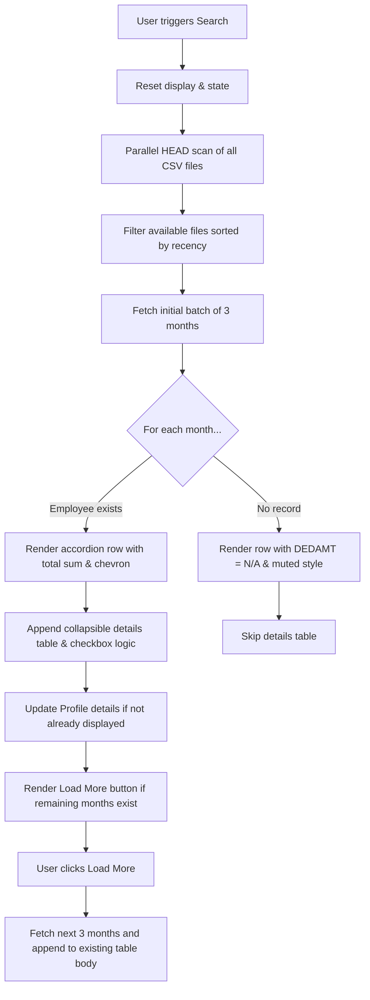

# Multi-Month Accordion & Pagination Implementation Guide

This guide details the system updates made to retrieve, paginate, and display multiple months of records in a collapsible accordion interface for both the **ON-QUEUE** (`index3`) and **PLI** (`index4`) modules.

## Architecture & Data Flow

## Features

### 1. Sequential Pagination (3-Month Batches)
- Resolves all existing files in parallel using lightweight HTTP `HEAD` calls to determine which files are active on the server.
- Fetches and processes 3 months at a time.
- Renders an inline **"Load More"** button matching the theme color with gradient backgrounds, box-shadows, and smooth translate hover animations.
- When the oldest month is reached, the button is automatically removed.

### 2. Accordion Interface
- Clicking a month row toggles the visibility of its corresponding details table.
- A chevron arrow icon (`bi-chevron-left` / `bi-chevron-right`) visually signals the collapsed/expanded state.
- For "blank" months (no record found), the system displays `N/A` for the sum, disables the expand arrow, and styles the row to look muted.

### 3. Checkbox Value Calculations
- Each month's detail checkbox calculates its total amount independently.
- Changing a checkbox only updates the total amount inside the header row of that specific month, avoiding collision.
